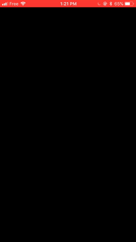

# Deezer Classroom

### An introduction to shaders on iOS

Join us to discover GLSL fragment shaders on iOS and build something cool with it.

### What you will build

At the end of the class you will be able to generate the Deezer logo, and animate it with 
music.

### Requirements

Xcode 8.3.x or Xcode9GM

Works on simulator, looks better on device.

That has to do with the simulator software rendering shaders.

The content of this classroom is given in `RESOURCES.MD`

### Bibliography

[Shadertoy](https://www.shadertoy.com)

[The Book of Shaders](https://thebookofshaders.com/)

[GLSL @ khronos group](https://www.khronos.org/opengl/wiki/OpenGL_Shading_Language)

[Knitstagram](https://github.com/ArthurGuibert/Knitstagram)

### Big thanks to 

Arthur Guibert / Axelle Migniot / Bertrand Longevialle / Dorothée Doublet @Deezer 

[Hugues Bernet-Rollande](xdev.fr)

[And Deezer for sponsoring this event](http://jobs.deezer.com/)

### License

This software is under Beerware.

It is based on another cool project, Knitstagram, from Arthur Guibert @birslip

[Availlable here under MIT](https://github.com/ArthurGuibert/Knitstagram)

